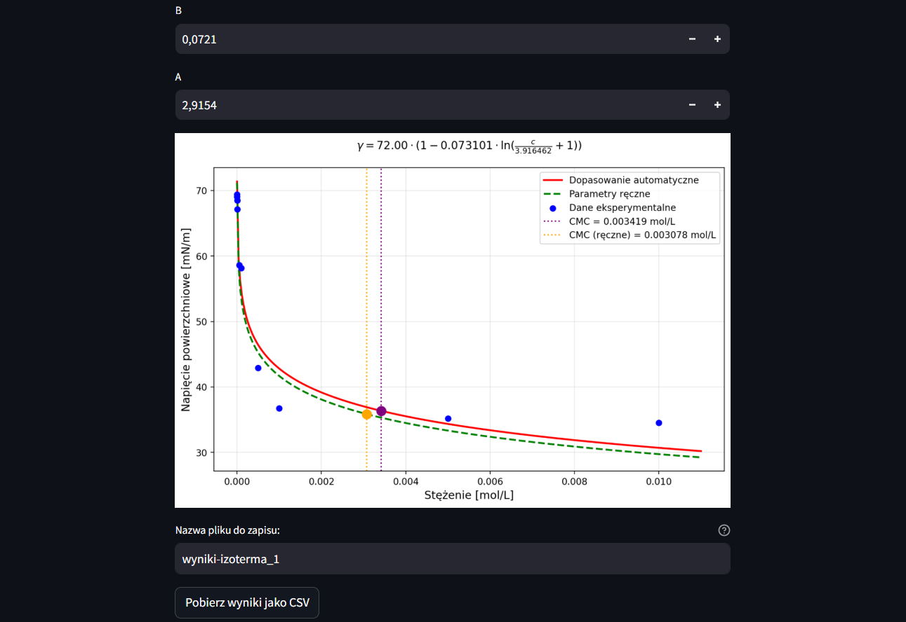

Bioinformatyka 2025 MGR

# 📘 Wybierz język / Choose language

- 🇵🇱 [Polski](#opis-aplikacji)
- 🇬🇧 [English](#application-description)

---

# OPIS APLIKACJI

## ⚙️Instalacja i uruchomienie

### Informacje

Aplikacja powstała w środowisku Python i do poprawnego działania wymaga kilku bibliotek:

- streamlit ( 1.44.1+)
- numpy (1.26.4+)
- pandas (2.2.2+)
- matplotlib (3.9.1+)
- scipy (1.13.1+)

Aplikacja została stworzona na wersjach zawartych w nawiasach powyżej. Zalecane jest korzystanie z tych lub nowszych wersji.

### Uruchomienie

Istnieją trzy sposoby włączenia aplikacji:

- [Dostęp online](https://chemist-assist.streamlit.app/) - Aplikacja została zbudowana na bazie biblioteki streamlit co umożliwia hostowanie jej online. Nie wymaga instalowania żadnych bibliotek.
- **Z użyciem skryptu:**
  1. W pobranym folderze zlokalizuj plik start_app.bat, lewym przyciskiem myszy kliknij dwa razy
  2. Plik ten włączy skrypt który sprawdzi dostępność bibliotek. Jeśli nie wykryje jakiejkolwiek spośród wymaganych, przystąpi do instalacji. Jeśli użytkownik posiada wszystkie wymagane biblioteki, okno aplikacji włączy się w oknie domyślnej przeglądarki
- **Poprzez terminal:** w pobranym folderze za pomocą terminala należy wywołać komendę: `streamlit run Home.py` (Zalecane użycie `--server.runOnSave=false` na końcu komendy w celu szybszego działania aplikacji)

> [!WARNING]
> W przypadku włączenia aplikacji przez skrypt (podpunk drugi), nie należy wyłączać aplikacji terminal. Jest ona wymagana do działania aplikacji. Po zakończeniu korzystania z aplikacji, można zamknąć terminal.

## 📈 Izoterma napięcia powierzchniowego — Model Szyszkowskiego

Ta zakładka umożliwia analizę danych eksperymentalnych opisujących zależność napięcia powierzchniowego od stężenia surfaktantu w roztworze. Wykorzystywany jest model Szyszkowskiego z ustalaną przez użytkownika wartością napięcia powierzchniowego wody (domyślnie γ₀ = 72 mN/m), a parametry izotermy są dopasowywane do danych metodą najmniejszych kwadratów.

**Funkcjonalności**:

- Wczytywanie danych z pliku CSV (z kolumnami `stezenie` i `napiecie`).
- Dopasowanie krzywej modelu Szyszkowskiego do danych pomiarowych.
- Obliczanie i prezentacja kluczowych parametrów fizykochemicznych:
  - **B** i **A** — parametry modelu,
  - **CMC** — krytyczne stężenie micelarne,
  - **Γ (CMC)** i **Γ_max** — nadmiar powierzchniowy,
  - **ΔG_m** — energia swobodna micelizacji,
  - **R²** — współczynnik dopasowania modelu.
- **Interaktywna analiza wpływu parametrów modelu na kształt krzywej i wartość CMC**.
- Wsparcie dla surfaktantów jonowych i niejonowych (z możliwością określenia stopnia dysocjacji α).
- Eksport wyników analizy do pliku CSV o podanej nazwie.

Podgląd:

## 📉 Analiza kinetyki adsorpcji – wyznaczanie współczynników dyfuzji i stałej `k₂`

Ta zakładka umożliwia analizę danych kinetycznych z eksperymentów pomiaru napięcia powierzchniowego w czasie życia pęcherzyka (metoda `t-life`). Na podstawie zależności między napięciem powierzchniowym (`σ`) a czasem (`Tlife`) możliwe jest wyznaczenie współczynnika dyfuzji surfaktantu oraz stałej `k₂` opisującej szybkość adsorpcji.

### Funkcjonalności:

- **Wczytywanie dwóch plików wejściowych** (`.txt`):
  - jeden reprezentujący **obszar premicelarny**,
  - drugi – **obszar micelarny**.

- **Podgląd i selekcja punktów** do analizy:
  - wyświetlanie danych w formie tabeli,
  - możliwość **zaznaczania/odznaczania punktów**, które mają zostać uwzględnione w dopasowaniu i obliczeniach.

- **Automatyczne przekształcenie danych** do postaci:
  - `√Tlife` – analiza dla obszaru **premicelarnego**,
  - `1/Tlife` – analiza dla obszaru **micelarnego**.

- **Dopasowanie liniowe** zależności `σ` od przekształconej osi X dla każdego pliku osobno.

- **Obliczenie i prezentacja współczynnika kierunkowego** (nachylenia prostej regresji) dla każdego obszaru.

- **Wyznaczenie współczynnika dyfuzji `D`** na podstawie nachylenia regresji i podanych parametrów:
  - `n` – liczba cząsteczek (1 dla niejonowych, 2 dla jonowych),
  - `T` – temperatura (°C, °F lub K),
  - `c` – stężenie surfaktantu (mol/L, automatycznie przeliczane na mol/m³),
  - uwzględnione jednostki: `σ` konwertowane z mN/m do N/m.

- **Obliczenie stałej `k₂`** wg wzoru:

$$
k_2 = \frac{4}{\pi} \cdot \left( \frac{a_{\text{micelarny}}}{a_{\text{premicelarny}}} \right)^2
$$

  gdzie `a` to współczynniki kierunkowe z regresji liniowej. Jednostką `k₂` jest ms.

## 💧 Wyznaczanie kąta zwilżania

Zakładka umożliwia obliczenie kąta zwilżania na podstawie danych eksperymentalnych – pomiaru przyrostu masy próbki w funkcji czasu w trakcie zwilżania powierzchni cieczą.

**Funkcjonalności**:

- Możliwość podania parametrów fizykochemicznych cieczy:
  - `η` – lepkość cieczy [mPa·s],
  - `ρ` – gęstość cieczy [g/cm³],
  - `γ` – napięcie powierzchniowe cieczy [mN/m],
  - `B` – stała materiałowa próbki.
- Wczytywanie danych z pliku `.csv` z kolumnami:
  - `czas` – czas w sekundach,
  - `masa` – masa próbki w gramach.
- Automatyczne przeliczenie wartości `masa²` i wizualizacja danych.
- Możliwość interaktywnego wyboru zakresu czasu do przeprowadzenia regresji liniowej (`masa²` vs. `czas`).
- Obliczenie parametrów regresji:
  - współczynnika kierunkowego,
  - wyznaczenie stałej `A = 1/slope`.
- Obliczenie kąta zwilżania θ na podstawie wzoru:

$$
\cos(\theta) = \frac{\eta}{B \cdot \rho^2 \cdot \gamma \cdot A}, \quad \theta = \arccos(\cos(\theta))
$$

- Prezentacja wyników:
  - wartość współczynnika kierunkowego,
  - stała `A`,
  - `cos(θ)` oraz kąt zwilżania `θ` w stopniach.
- Wizualizacja danych i dopasowanej prostej regresji na wykresie:
  - zakres regresji oznaczony kolorystycznie,
  - linie pomocnicze wyznaczające wybrany przedział czasu.

## ⚡ Wyznaczanie energii powierzchniowej

Zakładka umożliwia obliczenie energii powierzchniowej różnych cieczy za pomocą dwóch metod: Zismana oraz OWRK.

### Metoda Zismana

- Pozwala na wyznaczenie krytycznej energii powierzchniowej na podstawie kąta zwilżania i napięcia powierzchniowego.
- Użytkownik może wybrać jedną z predefiniowanych cieczy lub wprowadzić własne parametry cieczy (napięcie powierzchniowe `γ`, składniki `γᵈ` i `γᵖ`).
- Do obliczenia wykorzystywana jest regresja liniowa pomiędzy `γ` a `cos(θ)`, gdzie `θ` to kąt zwilżania.
- Po obliczeniach wyświetlana jest krytyczna energia powierzchniowa (`γ_c`), a także wykres z regresją i oznaczeniem wartości krytycznej.

### Metoda OWRK

- Umożliwia wyznaczenie składników energii powierzchniowej na podstawie danych o składnikach dyspersyjnym (`γᵈ`) i polarnym (`γᵖ`).
- Wymaga minimum dwóch punktów z uzupełnionymi wartościami `γᵈ` i `γᵖ`.
- Obliczane są:
  - składnik polarny powierzchni `γˢᵖ`,
  - składnik dyspersyjny powierzchni `γˢᵈ`,
  - całkowita energia powierzchniowa `γˢ`.

**Funkcjonalności**:

- Dodawanie punktów pomiarowych dla różnych cieczy i ich parametrów,
- Możliwość edytowania lub usuwania wprowadzonych punktów,
- Interaktywna wizualizacja wyników za pomocą wykresów,
- Obliczenia energii powierzchniowej oraz wyświetlanie wyników metodą Zismana i OWRK.

# APPLICATION DESCRIPTION

## ⚙️ Installation and Launch

### Requirements

The application was developed in Python and requires the following libraries:

- streamlit (1.44.1+)
- numpy (1.26.4+)
- pandas (2.2.2+)
- matplotlib (3.9.1+)
- scipy (1.13.1+)

The app was tested with the above versions, and it is recommended to use them or newer.

### Running the Application

There are three ways to launch the application:

- [Online access](https://chemist-assist.streamlit.app/) – The app is built using the Streamlit framework, which enables online hosting. No installation is required.
- **Via script:**
  1. Locate the `start_app.bat` file in the downloaded folder and double-click it.
  2. The script checks for required libraries. If any are missing, they will be installed. If all are present, the app will open in the default browser.
- **Via terminal:**  
  In the project folder, run the following command:  
  `streamlit run Home.py`  
  (It is recommended to add `--server.runOnSave=false` at the end to improve performance.)

> [!WARNING]  
> If using the script, **do not close the terminal** while the app is running. You can close it once you are done.

## 📈 Surface Tension Isotherm – Szyszkowski Model

This section allows for the analysis of experimental data describing the relationship between surface tension and surfactant concentration in a solution. The Szyszkowski model is applied using a user-defined water surface tension (default γ₀ = 72 mN/m), and parameters are fitted using the least squares method.

**Features**:

- CSV file import (with `stezenie` and `napiecie` columns).
- Curve fitting using the Szyszkowski model.
- Calculation and presentation of key physicochemical parameters:
  - **B** and **A** – model constants,
  - **CMC** – critical micelle concentration,
  - **Γ (CMC)** and **Γ_max** – surface excess at CMC and theoretical maximum,
  - **ΔG_m** – free energy of micellization,
  - **R²** – goodness-of-fit coefficient.
- **Interactive adjustment** of model parameters and real-time curve visualization.
- Support for ionic and non-ionic surfactants (user-defined dissociation degree `α`).
- Export of fitted results to a user-named CSV file.

Preview:

## 📉 Adsorption Kinetics – Diffusion Coefficient and `k₂` Estimation

This section supports the analysis of surface tension kinetics data measured as a function of bubble lifetime (`t-life` method). Based on the relationship between surface tension (`σ`) and lifetime (`Tlife`), the app calculates the diffusion coefficient `D` and adsorption rate constant `k₂`.

### Features:

- **Import of two input files** (`.txt`, `.dat`):
  - one for the **premicellar region**,
  - one for the **micellar region**.

- **Point selection and filtering**:
  - Editable table view with **checkbox selection** for including/excluding specific points.

- **Automatic transformation of data**:
  - `√Tlife` – for **premicellar region**,
  - `1/Tlife` – for **micellar region**.

- **Linear regression** of σ vs transformed X separately for each region.

- **Display of regression slope** for both regions.

- **Calculation of diffusion coefficient `D`** based on:
  - `n` – aggregation number (1 for non-ionic, 2 for ionic),
  - `T` – temperature (°C, °F, or K),
  - `c` – surfactant concentration (mol/L, auto-converted to mol/m³),
  - conversion of `σ` from mN/m to N/m included.

- **Estimation of the adsorption rate constant `k₂`** using the formula:

$$
k_2 = \frac{4}{\pi} \cdot \left( \frac{a_{\text{micelarny}}}{a_{\text{premicelarny}}} \right)^2
$$

  where `a` is the slope from the regression. The unit of `k₂` is milliseconds (ms).

- **Clear visualization** of each dataset with fitted regression lines.

## 💧 Wetting Angle Estimation

This section calculates the contact angle of a surface based on experimental mass gain during the wetting process.

**Features**:

- Manual input of fluid physicochemical properties:
  - `η` – viscosity [mPa·s],
  - `ρ` – density [g/cm³],
  - `γ` – surface tension [mN/m],
  - `B` – material constant of the solid surface.
- CSV file input containing:
  - `czas` – time in seconds,
  - `masa` – sample mass in grams.
- Automatic computation of `masa²` and data visualization.
- **Interactive selection of time range** for linear regression (`masa²` vs `czas`).
- Linear regression output:
  - slope of the fitted line,
  - calculation of constant `A = 1/slope`.
- **Computation of the contact angle θ** based on:

$$
\cos(\theta) = \frac{\eta}{B \cdot \rho^2 \cdot \gamma \cdot A}, \quad \theta = \arccos(\cos(\theta))
$$

- Display of results:
  - slope, constant `A`,
  - `cos(θ)` and angle `θ` in degrees.
- Visualization of selected time interval and regression line.

## ⚡ Surface Energy Calculation

This section allows for the determination of surface energy of liquids using the **Zisman method** or **OWRK method**.

### Zisman Method

- Estimates the critical surface energy from contact angle and surface tension data.
- Supports predefined or user-defined liquid parameters (`γ`, `γᵈ`, `γᵖ`).
- Performs linear regression of `γ` vs `cos(θ)`.
- Displays the **critical surface energy (γ_c)** and the regression plot with its intersection.

### OWRK Method

- Estimates surface energy components based on dispersive (`γᵈ`) and polar (`γᵖ`) contributions.
- Requires at least two measurements with full component values.
- Calculates:
  - surface polar component `γˢᵖ`,
  - surface dispersive component `γˢᵈ`,
  - total surface energy `γˢ`.

**Features**:

- Add and edit liquid measurement points with individual parameters.
- Delete, modify, and visualize selected data.
- Display of OWRK and Zisman results with graphical output.

