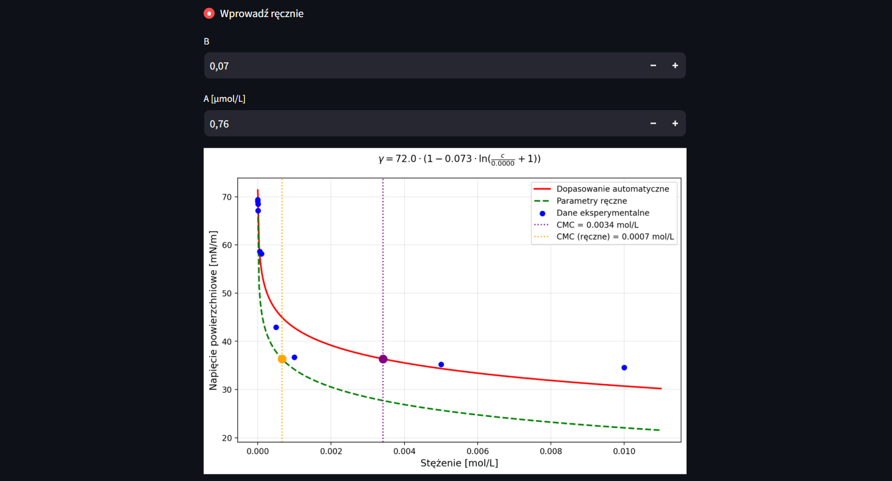

Bioinformatyka 2025 MGR

# OPIS APLIKACJI

## 📈 Izoterma napięcia powierzchniowego — Model Szyszkowskiego

Ta zakładka umożliwia analizę danych eksperymentalnych opisujących zależność napięcia powierzchniowego od stężenia surfaktantu w roztworze. Wykorzystywany jest model Szyszkowskiego z ustaloną wartością napięcia powierzchniowego czystej wody (γ₀ = 72 mN/m), a parametry izotermy są dopasowywane do danych metodą najmniejszych kwadratów.

**Funkcjonalności**:

- Wczytywanie danych z pliku CSV (z kolumnami `stezenie` i `napiecie`).
- Dopasowanie krzywej modelu Szyszkowskiego do danych pomiarowych.
- Obliczanie i prezentacja kluczowych parametrów fizykochemicznych:
  - **B** i **A** — parametry modelu,
  - **CMC** — krytyczne stężenie micelarne,
  - **Γ (CMC)** i **Γ_max** — nadmiar powierzchniowy,
  - **ΔG_m** — energia swobodna micelizacji,
  - **R²** — współczynnik dopasowania modelu.
- **Interaktywna analiza wpływu parametrów modelu na kształt krzywej i wartość CMC**.
- Wsparcie dla surfaktantów jonowych i niejonowych (z możliwością określenia stopnia dysocjacji α).
- Eksport wyników analizy do pliku CSV.

Podgląd:

## 📉 Analiza kinetyki adsorpcji – wyznaczanie współczynników dyfuzji

Ta zakładka umożliwia analizę danych kinetycznych z eksperymentów pomiaru napięcia powierzchniowego w czasie życia pęcherzyka (metoda `t-life`). Na podstawie zależności między napięciem powierzchniowym (`σ`) a czasem (`Tlife`) możliwe jest wyznaczenie współczynnika dyfuzji surfaktantu.

**Funkcjonalności**:

- Wczytywanie danych z plików `.txt` lub `.dat` z kolumnami `sigma` i `Tlife`.
- Automatyczne przekształcenie danych do postaci:
  - `√Tlife` — analiza dla obszaru premicelarnego,
  - `1/Tlife` — analiza dla obszaru micelarnego.
- Dopasowanie liniowe zależności `σ` od przekształconej osi X.
- Obliczenie i prezentacja współczynnika kierunkowego (nachylenia prostej).
- Wyznaczenie **współczynnika dyfuzji D** na podstawie nachylenia krzywej oraz zadanych parametrów:
  - `n` – liczba cząsteczek (1 dla surfaktantów niejonowych, 2 dla jonowych),
  - `T` – temperatura w °C,
  - `c` – stężenie surfaktantu w mol/L.
- Interaktywna wizualizacja wyników na wykresie.
- Obsługa kodowania plików w standardzie Windows-1250 oraz separatorów tabulacji.

## 💧 Wyznaczanie kąta zwilżania

Zakładka umożliwia obliczenie kąta zwilżania na podstawie danych eksperymentalnych – pomiaru przyrostu masy próbki w funkcji czasu w trakcie zwilżania powierzchni cieczą.

**Funkcjonalności**:

- Możliwość podania parametrów fizykochemicznych cieczy:
  - `η` – lepkość cieczy [mPa·s],
  - `ρ` – gęstość cieczy [g/cm³],
  - `γ` – napięcie powierzchniowe cieczy [mN/m],
  - `B` – stała materiałowa próbki.
- Wczytywanie danych z pliku `.csv` z kolumnami:
  - `czas` – czas w sekundach,
  - `masa` – masa próbki w gramach.
- Automatyczne przeliczenie wartości `masa²` i wizualizacja danych.
- Możliwość interaktywnego wyboru zakresu czasu do przeprowadzenia regresji liniowej (`masa²` vs. `czas`).
- Obliczenie parametrów regresji:
  - współczynnika kierunkowego,
  - wyznaczenie stałej `A = 1/slope`.
- Obliczenie kąta zwilżania θ na podstawie wzoru:
  
cos(θ) = η / (B · ρ² · γ · A) θ = arccos(cos(θ))

- Prezentacja wyników:
  - wartość współczynnika kierunkowego,
  - stała `A`,
  - `cos(θ)` oraz kąt zwilżania `θ` w stopniach.
- Wizualizacja danych i dopasowanej prostej regresji na wykresie:
  - zakres regresji oznaczony kolorystycznie,
  - linie pomocnicze wyznaczające wybrany przedział czasu.

## ⚡ Wyznaczanie energii powierzchniowej

Zakładka umożliwia obliczenie energii powierzchniowej różnych cieczy za pomocą dwóch metod: Zismana oraz OWRK.

### Metoda Zismana
- Pozwala na wyznaczenie krytycznej energii powierzchniowej na podstawie kąta zwilżania i napięcia powierzchniowego.
- Użytkownik może wybrać jedną z predefiniowanych cieczy lub wprowadzić własne parametry cieczy (napięcie powierzchniowe `γ`, składniki `γᵈ` i `γᵖ`).
- Do obliczenia wykorzystywana jest regresja liniowa pomiędzy `γ` a `cos(θ)`, gdzie `θ` to kąt zwilżania.
- Po obliczeniach wyświetlana jest krytyczna energia powierzchniowa (`γ_c`), a także wykres z regresją i oznaczeniem wartości krytycznej.

### Metoda OWRK
- Umożliwia wyznaczenie składników energii powierzchniowej na podstawie danych o składnikach dyspersyjnym (`γᵈ`) i polarnym (`γᵖ`).
- Wymaga minimum dwóch punktów z uzupełnionymi wartościami `γᵈ` i `γᵖ`.
- Obliczane są:
  - składnik polarny powierzchni `γˢᵖ`,
  - składnik dyspersyjny powierzchni `γˢᵈ`,
  - całkowita energia powierzchniowa `γˢ`.

**Funkcjonalności**:
- Dodawanie punktów pomiarowych dla różnych cieczy i ich parametrów,
- Możliwość edytowania lub usuwania wprowadzonych punktów,
- Interaktywna wizualizacja wyników za pomocą wykresów,
- Obliczenia energii powierzchniowej oraz wyświetlanie wyników metodą Zismana i OWRK.